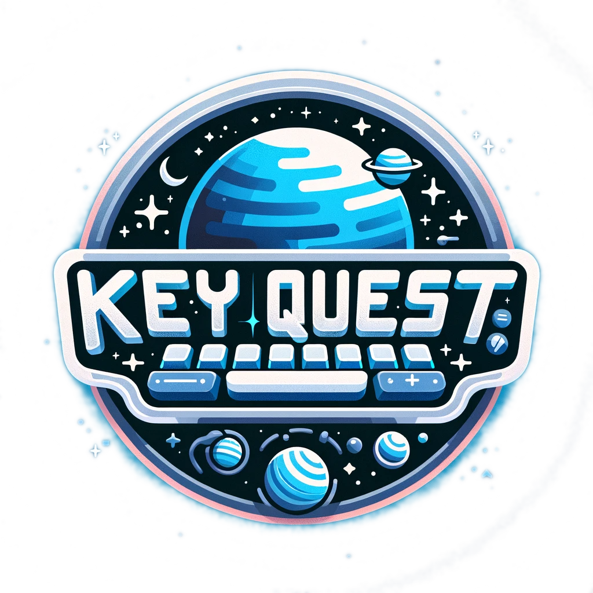

# Key Quest

<p align="center">
  
</p>

## Description

Welcome to Key Quest, an intergalactic typing adventure! In this game, you journey through the cosmos as a space explorer, encountering various challenges that test your typing skills. Whether it's dodging asteroids with quick keystrokes or communicating with alien species through precise typing, Key Quest offers an engaging and educational experience for typists of all levels.

This is mostly a cute game project to practice using React, Typescript, React Query, ChatGPT and to have some fun!

## Demo

Try the game [here](https://cosmic-noir.github.io/key-quest/)! Note this is a hobby project with bugs and features in development.

> **Note:** Currently, the app is deployed as a single-page application (SPA) using GitHub Pages. I'm actively working on deploying the full-stack version, including the backend, with a container-based service, stay tuned :D!

## Features

- **Dynamic Typing Challenges:** Encounter different typing tasks, from simple letters to complex words and phrases.
- **Difficulty Levels:** Choose your adventure's difficulty – Space Cadet, Orbital Officer, or Star Voyager.
- **Progress Tracking:** Keep track of your typing accuracy, words per minute, and overall score.
- **State Management with React Query:** Utilize the powerful features of React Query to manage game data with local storage.
- **User Authentication with Ruby on Rails: (Coming soon...)** Log in and manage your profile to save progress, access leaderboards, and more.

## Getting Started

### Prerequisites

Before running Key Quest, ensure you have the following installed:

- [Docker](https://docs.docker.com/engine/install/) - The core engine that builds, runs, and manages the containers. Packages the applications and depedencies into containers, ensuring they work consistently across different environments.
- [Docker Compose](https://docs.docker.com/compose/) (Comes with Docker Desktop) - additional tool that I'm using to manage this multi-container application. The `docker-compose.yml` file defines the services and allows us to run all of them together with a single command.

## Technology

This project is built using several modern web technologies and tools:

- **Frontend:**

  - [React](https://reactjs.org/): A JavaScript library for building user interfaces.
  - [TypeScript](https://www.typescriptlang.org/): An open-source language that builds on JavaScript by adding static type definitions.
  - [React Query](https://tanstack.com/query/latest/): A library for fetching, caching, and updating asynchronous data in React.
  - [Material-UI](https://mui.com/material-ui/): React UI framework with a comprehensive suite of pre-designed components.
  - [tsparticles](https://particles.js.org/): A lightweight JavaScript library for creating particles.
  - [Sass](https://sass-lang.com/): A powerful CSS extension language used for styling.
  - **esbuild**: A fast JavaScript bundler used to build the React frontend efficiently.

- **Backend:**

  - [Ruby](https://www.ruby-lang.org/): A dynamic, open-source programming language focused on simplicity and productivity.
  - [Ruby on Rails](https://rubyonrails.org/): The backend framework providing authentication, API services, and database management.

- **Database:**

  - [PostgreSQL](https://www.postgresql.org/): The relational database for managing user data and game progress.

- **DevOps and Deployment:**

  - **Docker**: Used to containerize the application, ensuring a consistent environment across development, testing, and production.
  - **Docker Compose**: Manages multi-container applications, making it easy to run the backend, frontend, and database together.

- **AI and Assistance:**
  - [ChatGPT](https://chat.openai.com/): Used throughout the project for brainstorming, coding assistance, and generating assets like images.

### Installation

> **_Note:_** Is your Docker daemon running? 😉 Make sure Docker Desktop or your Docker daemon is up and running before proceeding!

1. Clone the repository:

```sh
  git clone https://github.com/Cosmic-Noir/key-quest.git
```

2. Navigate to the project directory:

```sh
  cd key-quest
```

3. Build and start the containers:

```sh
 docker-compose up --build
```

4. Access the game:

Visit http://localhost:3000 in your browser to start playing!

5. Playing the Game -
   - Start the game, select a difficulty and level. Surviving levels unlocks the next adventure.
   - Type the letters and words as they appear on the screen.
   - Try to maintain accuracy and speed to maximize your score.
   - Avoid letting words or letters strike the forcefield, which will reduce your health.
   - When the health bar reaches 0 or the timer runs out, the level will end. Win by surviving until the timer runs out.
   - Used advanced difficulty settings to personalize your learning journey to your level!

### Project Management

Check out [the Trello board](https://trello.com/b/c6ke5JTC/key-quest) for a view of this projects development.

## Credits

### Background Music

"Space" by Chad Crouch

- Source: [Free Music Archive](https://freemusicarchive.org/music/Chad_Crouch/arps-ii/space-1/)
- License: [Attribution-NonCommercial 4.0 International (CC BY-NC 4.0)](https://creativecommons.org/licenses/by-nc/4.0/)

### Sound Effects

- "Laser Zap" sound effect by nsstudios, available on Freesound: [laser1.wav](https://freesound.org/people/nsstudios/sounds/321102/). Licensed under [Creative Commons Attribution 4.0](https://creativecommons.org/licenses/by/4.0/).
- "Ding 3" sound effect by andersmmg, available on Freesound: [Ding 3](https://freesound.org/people/andersmmg/sounds/523424/). Licensed under [Creative Commons Attribution 4.0](https://creativecommons.org/licenses/by/4.0/).
